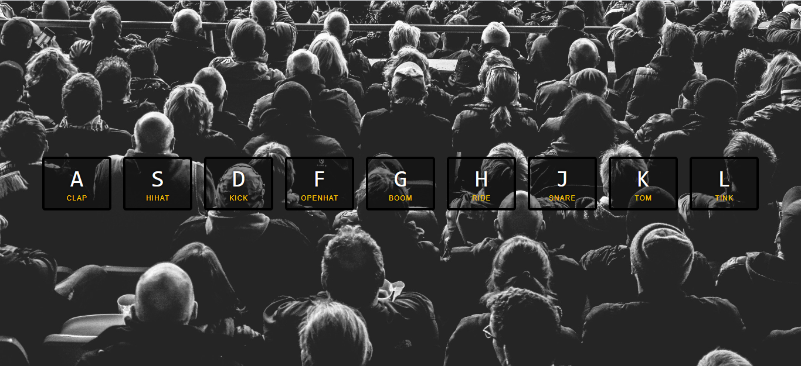

# Drum Kit

### #JavaScript30

This is the first of the 30 day Vanilla [JS Challenge](http://https://javascript30.com/ "JS Challenge") by Wes Bos. As its name, this project is a Drum Kit that plays different sounds whenever a specific key is pressed.

The **technologies** used were:
- JavaScript
- HTML
- CSS

And this is the final result of today's challenge:

